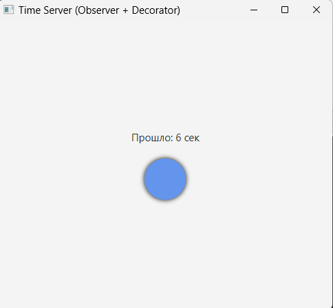
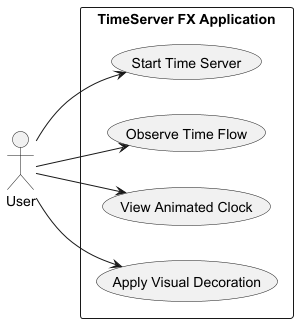
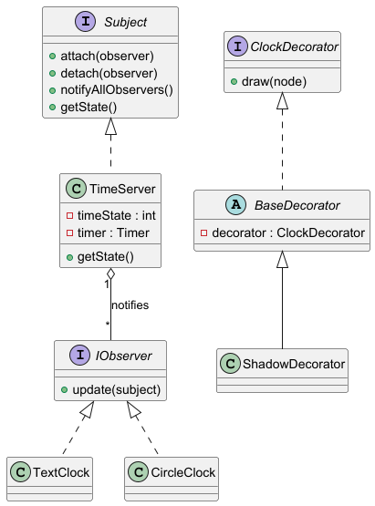
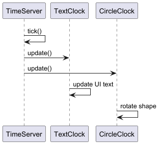

# TimeServer FX  
**Dark Edition** | Observer & Decorator Patterns

**Описание**:  
Данный проект представляет собой учебное JavaFX-приложение, демонстрирующее работу паттернов проектирования **Наблюдатель (Observer)** и **Декоратор (Decorator)** на примере локального сервера времени.

Приложение решает задачу синхронизации нескольких визуальных компонентов с единым источником времени. Сервер времени генерирует последовательные тики, а подписанные наблюдатели автоматически обновляют своё состояние при каждом изменении.

Проект предназначен для наглядного изучения принципов слабой связности компонентов, событийно-ориентированной архитектуры и расширения поведения объектов без изменения их исходного кода.

- **Технологический стек**:  
  Java 17, JavaFX, Maven. Приложение является standalone desktop-программой.

- **Статус**:  
  Учебный проект (Stable). Реализована минимально достаточная функциональность в рамках задания.

- **Ссылка на продукт или демо-экземпляр**:  
  Локальный запуск через Maven (`mvn javafx:run`).

- **Отличия от аналогичных проектов**:  
  Проект фокусируется на чистой реализации паттернов проектирования без избыточной логики, сторонних сервисов и сетевых протоколов.

**Скриншот рабочего окна приложения**:  


 

---

## Архитектура

Архитектура проекта построена вокруг паттерна **Observer**, где:
- `TimeServer` — субъект (Subject), хранящий состояние локального времени;
- визуальные компоненты (`TextClock`, `CircleClock`) — наблюдатели (Observer).

Дополнительно используется паттерн **Decorator** для динамического расширения визуального поведения компонентов JavaFX.

### Диаграммы

**Use Case Diagram**  


**Class Diagram**  


**Sequence Diagram**  


### Назначение пакетов `src`

- `observer` — реализация паттерна Наблюдатель
- `ui` — визуальные компоненты JavaFX
- `decorator` — реализация паттерна Декоратор
- корневой пакет `ru.yourname.timeserverfx` — точка входа приложения

---

## Зависимости

Для работы проекта необходимы:

- Java Development Kit (JDK) 17 или выше
- Apache Maven 3.8+
- JavaFX (подключается через Maven)

Другие внешние библиотеки не используются.

---

## Установка

1. Склонировать репозиторий:
   ```bash
   git clone <repository-url>
